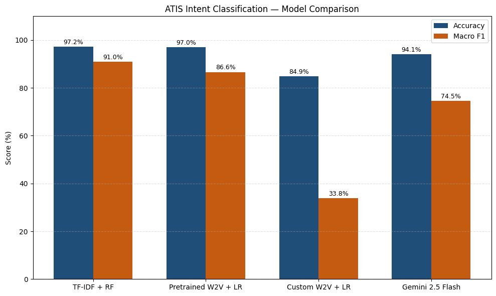

# ✈️ ATIS Intent Classification — Traditional vs LLM Approaches

A comparative NLP study on the [ATIS (Airline Travel Information System)](https://huggingface.co/datasets/tuetschek/atis) dataset, benchmarking classical machine learning pipelines against a prompt-based LLM (Gemini 2.5 Flash) for intent classification.

---

##  Overview

This project explores how well traditional NLP approaches hold up against modern large language models on a structured intent classification task. We classify airline-related queries into 8 intent categories using three distinct modeling strategies.

**Intents covered:**
`flight` · `airfare` · `ground_service` · `airline` · `abbreviation` · `aircraft` · `flight_time` · `quantity`

---

##  Repository Structure

```
nlp-intent-classification-atis/
│
├── NLPProject_F.ipynb               # Main notebook (EDA, modeling, evaluation)
├── gemini_predictions.csv           # Gemini 2.5 Flash predictions on the test set
└── README.md
```

---

##  Methodology

### 1. Data Preprocessing
- Loaded ATIS dataset via Hugging Face `datasets`
- Filtered to 8 selected intent classes
- Cleaning: lowercasing, punctuation removal
- Tokenization using NLTK's `word_tokenize`

### 2. Exploratory Data Analysis
- Intent distribution visualizations
- Sentence length analysis
- Token frequency analysis (before/after cleaning)
- Tokens per class breakdown

### 3. Models

| Model | Approach | Embeddings |
|---|---|---|
| TF-IDF + Random Forest | Traditional | Bag-of-words (TF-IDF) |
| Word2Vec + Logistic Regression | Traditional | Pretrained Google News W2V (300d) |
| Custom Word2Vec + Logistic Regression | Traditional | ATIS-trained W2V (300d) |
| Gemini 2.5 Flash | LLM (few-shot prompting) | None (prompt-based) |

For the Word2Vec models, sentence vectors are computed via **TF-IDF weighted mean pooling** over token embeddings.

Gemini is queried with a structured few-shot prompt and constrained to output one of the 8 valid intent labels.

### 4. Evaluation
- Classification report (precision, recall, F1 per class)
- Confusion matrices (heatmaps)
- Side-by-side accuracy & macro-F1 bar chart across all four models

---

## 📊 Results

The final comparison evaluates all models on the ATIS test set using **Accuracy** and **Macro F1-Score**.



---

## ⚙️ Setup & Requirements

```bash
pip install gensim google-generativeai datasets nltk scikit-learn pandas matplotlib seaborn
```

To run the Gemini section, add your API key to your environment:
```python
GEMINI_API_KEY = "your-api-key-here"
```

> The notebook was originally developed on **Google Colab**. The `userdata.get('GEMINI_API_KEY')` call can be replaced with `os.environ.get(...)` or a direct string for local use.

---

##  Files

| File | Description |
|---|---|
| `NLPProject_F.ipynb` | Full pipeline: EDA → preprocessing → modeling → evaluation |
| `gemini_predictions.csv` | Saved Gemini predictions (text, true label, predicted label) |

---

##  Key Takeaways

- TF-IDF + Random Forest is a strong and fast baseline for short, structured text
- TF-IDF weighted Word2Vec pooling improves representational quality over raw averaging
- Gemini 2.5 Flash achieves competitive results with **zero task-specific training**, using only a few-shot prompt
- Structured domains like ATIS benefit traditional models due to low lexical diversity

---

## Dataset

[ATIS — Airline Travel Information System](https://huggingface.co/datasets/tuetschek/atis) via Hugging Face Datasets
